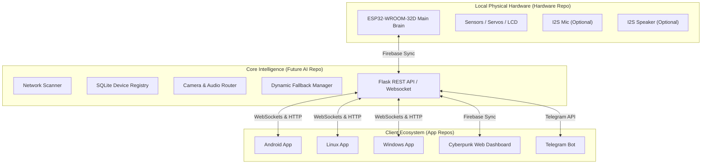

# 🤖 PROJECT MEKA — The Ultimate Master Guide
> **Version 3.0** | *Decentralized JARVIS-Class AI Assistant & IoT Orchestrator*


---

## 📋 Comprehensive Table of Contents
1. [📖 Project History & Evolution](#-project-history--evolution)
2. [👤 Non-Technical User Guide (How to Use MEKA)](#-non-technical-user-guide)
3. [🏗️ The 7-Pillar Modular Architecture](#-the-7-pillar-modular-architecture)
4. [🧠 Deep Dive: Functions & System Flow](#-deep-dive-functions--system-flow)
5. [🔌 Hardware Specifications, Schematics & Pinouts](#-hardware-specifications-schematics--pinouts)
6. [🗣️ Voice Commands & Capabilities](#-voice-commands--capabilities)
7. [📡 Full API Reference (IoT Hub)](#-full-api-reference-iot-hub)
8. [🔐 Security & Authentication Model](#-security--authentication-model)
9. [💻 Cross-Platform Client Development](#-cross-platform-client-development)
10. [🚀 Super Deployment Guide](#-super-deployment-guide)
11. [🛠️ Troubleshooting & Diagnostics](#-troubleshooting--diagnostics)

---

## 📖 Project History & Evolution

Project MEKA represents the culmination of years of iterative development, transitioning from a simple hobbyist microcontroller project into a robust, decentralized, multi-platform ecosystem.

### v1.0 (The Monolith)
MEKA began its life as a massive, unified repository. The ESP32 hardware firmware, the Python backend routing server, and the mobile application code were all tangled together. This made version control chaotic and deployments heavy. In v1.0, MEKA relied exclusively on physical hardware attached to the ESP32. If the physical INMP441 microphone broke, the entire system went deaf. 

### v2.0 (The Network Awakening)
Recognizing the limitations of static hardware, v2.0 introduced the **Dynamic Hardware Fallback Engine**. MEKA was no longer tied to its physical body. If the physical microphone failed, the IoT Hub would automatically scan the local network and route audio input through the nearest authenticated smartphone or desktop client. The system became network-aware, utilizing mDNS and ARP scanning to discover devices.

### v2.5 (The Persona Upgrade)
MEKA needed a soul. The firmware was completely rewritten to support an advanced dual-line I2C LCD scrolling matrix. Instead of generic text, the system was programmed to display `"Q: [User Input]"` on the top line and `"A: [MEKA Response]"` on the bottom line, complete with a persistent `"Meka v1.0.1"` branding. The UI started feeling like a professional, premium entity.

### v3.0 (The Great Decentralization - Current)
To achieve enterprise-grade scalability, the monolithic repository was securely wiped and partitioned into **7 independent GitLab repositories**. The architecture was completely decoupled. The central intelligence hub is now preparing to sever ties with external cloud APIs (like OpenAI and Google) and transition entirely to local, offline AI models (using `llama.cpp` and Whisper) for zero-latency, absolute-privacy interactions.

---

## 👤 Non-Technical User Guide
*A simple, plain-English guide on how to live and interact with your new AI assistant.*

### What exactly is MEKA?
Think of MEKA as the central nervous system of your home or workspace. Unlike traditional smart speakers (like Alexa or Google Home) which are confined to a plastic cylinder, MEKA lives everywhere. MEKA is in your phone, on your computer, in your web browser, and physically present in its ESP32 chassis. 

### How do I talk to MEKA?
You have multiple ways to communicate, depending on where you are:
1. **From your Smartphone:** Open the MEKA Android App. Say the wake word **"MEKA"**. The app will listen to your command and instantly execute it.
2. **From the Physical Robot:** If you are standing near the physical MEKA chassis (the ESP32 board), simply speak to it. Its built-in microphones will pick up your voice, and its LCD screen will display its response as it speaks back to you.
3. **From Telegram:** If you are miles away from home, you can simply text MEKA using your secure Telegram bot. You can text it to *"Turn on the living room lights"* or *"Send me a snapshot from the security camera."*

### What happens when I speak?
1. You say: *"MEKA, scan the network for new devices."*
2. Your voice is sent to the central MEKA Brain (the IoT Hub).
3. The Brain translates your voice into text.
4. The Brain understands your intent and executes the network scan.
5. The Brain formulates a response ("I have found 3 new devices.") and sends it back to you as synthesized audio.

---

## 🏗️ The 7-Pillar Modular Architecture

MEKA is split into 7 independent pillars, each meticulously designed for a specific duty. This separation of concerns ensures that if one component fails, the rest of the ecosystem survives.

### 1. Telegram Bot (Telemetry & Control)

- **Role:** Secure remote access and emergency override.
- **Deep Dive:** This Python-based daemon connects to the Telegram API. It verifies incoming messages against a strict Access Control List (ACL) stored in Firebase. Authorized users can trigger system restarts, view live health reports, and reroute audio/video streams remotely.
- **Repository:** [https://gitlab.com/project-meka/Telegram](https://gitlab.com/project-meka/Telegram)

### 2. Webapp (The Cybernetic Dashboard)

- **Role:** The visual command center.
- **Deep Dive:** Built with React and Vite, this dashboard eschews standard design norms in favor of a heavy Cyberpunk aesthetic (neon glows, glassmorphism, micro-animations). It subscribes to the Firebase Realtime Database to render live sensor telemetry (temperature, humidity) and allows administrators to manually override hardware states without writing code.
- **Repository:** [https://gitlab.com/project-meka/Webapp](https://gitlab.com/project-meka/Webapp)

### 3. Hardware (The Physical Shell)

- **Role:** The physical body and sensory input.
- **Deep Dive:** Powered by the ESP32-WROOM-32D microcontroller. The C++ firmware utilizes non-blocking `millis()` logic to simultaneously handle physical sensor polling, I2C LCD matrix scrolling, and WebSocket communication. It includes OpenSCAD 3D models for printing the physical chassis.
- **Repository:** [https://gitlab.com/project-meka/Hardware](https://gitlab.com/project-meka/Hardware)

### 4. Android APP (The Mobile Bridge)

- **Role:** The on-the-go pocket companion.
- **Deep Dive:** Built in Flutter, this app runs a persistent background foreground service. It uses highly optimized on-device audio processing to constantly listen for the "MEKA" wake word without draining the smartphone battery.
- **Repository:** [https://gitlab.com/project-meka/Android-APP](https://gitlab.com/project-meka/Android-APP)

### 5. Linux APP (Workstation Integration)

- **Role:** Native desktop client for Linux environments.
- **Deep Dive:** Utilizes the Flutter Linux GTK embedder to provide a native workstation experience. Perfect for developers who want MEKA listening in the background while they write code.
- **Repository:** [https://gitlab.com/project-meka/Linux-APP](https://gitlab.com/project-meka/Linux-APP)

### 6. Windows APP (Workstation Integration)

- **Role:** Native desktop client for Windows environments.
- **Deep Dive:** Compiled to native C++ Windows binaries via Flutter. It sits in the system tray, providing lightning-fast access to hardware overrides and voice commands.
- **Repository:** [https://gitlab.com/project-meka/Windows-APP](https://gitlab.com/project-meka/Windows-APP)

### 7. Future (AI) Hub (The Brain)

- **Role:** The central router, logic processor, and IoT orchestrator.
- **Deep Dive:** This Python Flask server is the glue that holds MEKA together. It translates API calls, manages the dynamic hardware fallback hierarchy, runs network discovery scans (mDNS/ARP), and interfaces with external AI APIs. It is currently being refactored to host local offline LLMs (Llama 3) for total privacy.
- **Repository:** [https://gitlab.com/project-meka/Future-AI](https://gitlab.com/project-meka/Future-AI)

---

## 🧠 Deep Dive: Functions & System Flow

### The Stateless Synchronization Engine (Firebase)
A core architectural principle of MEKA is that **no client talks directly to another client.** Everything is routed through a centralized state tree hosted on Firebase Realtime Database.
- When the Android app wants to turn on the ESP32's yellow LED, it does NOT send an HTTP request to the ESP32. 
- Instead, the Android app mutates the Firebase state: `hardware/led/yellow/state = true`.
- The ESP32 maintains an open, persistent WebSocket connection to Firebase. It receives the state change within 50 milliseconds and physically turns on the LED.
- The Webapp, also subscribed to Firebase, receives the same state change and updates its UI to show the LED as glowing.

### System Flow Diagram


### Dynamic Hardware Fallback Logic Explained
The Future (AI) Hub runs a continuous health check loop on the ESP32 hardware via the `/status` endpoint.
1. **The Microphone Hierarchy:**
   - Priority 1: Physical INMP441 I2S Microphone connected to the ESP32.
   - Priority 2: If physical mic is dead/missing, the Hub commands the nearest active Android App to open its microphone and stream raw audio data over WebSockets to the Hub.
   - Priority 3: If no Android app is found, it falls back to the Desktop (Linux/Windows) client microphone.
2. **The Speaker Hierarchy:**
   - Priority 1: Physical MAX98357A I2S Speaker connected to ESP32.
   - Priority 2: Known, paired Bluetooth soundbars/speakers.
   - Priority 3: The Android/Desktop client speakers.
3. **The Camera Hierarchy:**
   - Priority 1: ESP32-CAM nodes on the local network.
   - Priority 2: Third-party RTSP IP Security Cameras.
   - Priority 3: The "Phone Bridge" (using an old smartphone's camera via WebRTC).

---

## 🔌 Hardware Specifications, Schematics & Pinouts

The physical hardware of MEKA is primarily driven by the powerful **ESP32-WROOM-32D** microcontroller. It handles intense tasks like asynchronous LCD rendering and WiFi stack management effortlessly due to its dual-core Xtensa architecture.

### 1. ESP32-WROOM-32D Main Board Wiring
| Component          | Pin Function         | ESP32 GPIO  | Operating Voltage / Notes  |
| --------------------| ----------------------| -------------| ----------------------------|
| **Blue LED**       | Listening Status     | **GPIO 26** | 3.3V via 220Ω resistor     |
| **Yellow LED**     | Processing Status    | **GPIO 27** | 3.3V via 220Ω resistor     |
| **Green LED**      | Success Status       | **GPIO 14** | 3.3V via 220Ω resistor     |
| **Red LED**        | Error Status         | **GPIO 12** | 3.3V via 220Ω resistor     |
| **Built-in LED**   | System Heartbeat     | **GPIO 2**  | Internal                   |
| **DHT22 Sensor**   | Temperature/Humidity | **GPIO 4**  | 3.3V (10kΩ pull-up to VCC) |
| **Servo Motor**    | Physical Pan/Tilt    | **GPIO 18** | 5V Power, 3.3V Signal      |
| **Buzzer**         | Audio Alerts         | **GPIO 15** | Active Buzzer              |
| **Analog In**      | LDR / Voltage Sensor | **GPIO 34** | Analog Input (Input Only)  |
| **LCD 1602 (I2C)** | SDA (Data)           | **GPIO 21** | 5V Power for Backlight     |
| **LCD 1602 (I2C)** | SCL (Clock)          | **GPIO 22** | 5V Power for Backlight     |

### 2. Optional Attached Audio Modules (Probed Automatically on Boot)
| Module | Pin Function | ESP32 GPIO | Notes |
|---|---|---|---|
| **INMP441 I2S Mic** | SCK (Clock) | **GPIO 32** | Probed on boot |
| **INMP441 I2S Mic** | WS (Word Select) | **GPIO 33** | Probed on boot |
| **INMP441 I2S Mic** | SD (Serial Data) | **GPIO 34** | Shared input pin |
| **INMP441 I2S Mic** | L/R (Channel) | **GND** | Left channel |
| **MAX98357A Speaker** | BCLK (Bit Clock) | **GPIO 25** | Probed on boot |
| **MAX98357A Speaker** | LRC (Left/Right) | **GPIO 15** | Shared multiplexed pin |
| **MAX98357A Speaker** | DIN (Data In) | **GPIO 2** | Shared output pin |

### The `meka_esp32.ino` Firmware Logic
The firmware is written using the Arduino framework in PlatformIO. 
**Key feature:** The LCD 16x2 screen only holds 16 characters per line. The firmware contains a complex string-buffer algorithm. When the AI generates a response that is 100 characters long, the ESP32 splits it into two lines (`Q: [Question]` and `A: [Answer]`) and uses `millis()` timers to smoothly scroll the text horizontally across the physical screen without blocking the network threads from listening for new commands.

---

## 🗣️ Voice Commands & Capabilities

MEKA leverages advanced Large Language Models (LLMs) to interpret natural language. You don't have to speak rigid command structures; you can speak naturally, and the LLM will parse your intent and map it to a specific JSON payload.

### Standard Command Mapping
| Spoken Phrase | Triggered Action JSON |
|---|---|
| *"Scan the network for new devices"* | `{"action":"iot_scan"}` |
| *"Show me all connected cameras"* | `{"action":"iot_list_cameras"}` |
| *"Start recording all cameras"* | `{"action":"iot_record","camera":"all","state":"start"}` |
| *"Stop recording"* | `{"action":"iot_record","camera":"all","state":"stop"}` |
| *"Take a snapshot of the front door"*| `{"action":"iot_snapshot","camera":"front_door"}` |
| *"Switch microphone to my phone"* | `{"action":"iot_select_mic","device_id":"phone"}` |
| *"Scan for Bluetooth devices"* | `{"action":"iot_bluetooth_scan"}` |
| *"Connect to the living room speaker"*| `{"action":"iot_bluetooth_connect","mac":"XX:XX:XX"}` |
| *"Turn on the yellow LED"* | `{"action":"esp32_led","color":"yellow","state":"on"}` |
| *"Look to the right"* | `{"action":"esp32_servo","angle":180}` |

---

## 📡 Full API Reference (IoT Hub)

The Python Future (AI) Hub exposes a robust REST API on Port 5000. This API allows any third-party script or application to hook into the MEKA ecosystem.

### System & Core
- `GET /api/status` - Returns Hub uptime, memory usage, and connected client count.
- `GET /api/fallback/status` - Returns the current hardware fallback routing state (e.g., "Audio output routed to Android-Client-1").

### Network Discovery
- `GET /api/devices` - Lists all devices in the local SQLite registry.
- `POST /api/devices/scan` - Forces an immediate ARP/mDNS broadcast to find new IP devices.

### Camera & Video Operations
- `GET /api/cameras` - Returns a JSON array of all authenticated RTSP/IP cameras on the network.
- `GET /api/cameras/<mac>/stream` - Outputs a live, transcoded MJPEG stream of the requested camera.
- `POST /api/cameras/<mac>/record/start` - Triggers background MP4 recording to the Hub's hard drive.
- `GET /api/cameras/<mac>/snapshot` - Captures and returns a single JPEG frame.

### Audio Routing
- `GET /api/audio/microphones` - Lists all network nodes currently offering microphone services.
- `GET /api/audio/speakers` - Lists all network nodes offering speaker services.
- `POST /api/audio/mic/select` - Overrides the fallback logic and forces a specific microphone node to become active.
- `POST /api/audio/speaker/select` - Overrides the fallback logic and forces a specific speaker node.

### Bluetooth Control
- `GET /api/bluetooth/scan` - Triggers a Bluetooth BLE and Classic scan for nearby peripherals.
- `POST /api/bluetooth/connect` - Initiates pairing and connection to a provided Bluetooth MAC address.

---

## 🔐 Security & Authentication Model

MEKA is designed to operate on local networks, but security is paramount, especially when bridging to mobile apps outside the home via Firebase.

1. **One-Time Permission Registry:**
   When a new device (like a smart TV or a guest's smartphone) joins the local network, the IoT Hub detects it via ARP scanning. However, MEKA ignores the device completely until an Administrator explicitly calls the `/api/devices/<mac>/permit` endpoint. Once granted, the permission is persisted in the SQLite database forever.
2. **Biometric & Voice-Print Authentication:**
   The Flutter Mobile Apps integrate directly with Android/iOS native biometric APIs (Fingerprint/FaceID). Before the app sends a highly destructive command (like unlocking a smart door lock), it requests biometric confirmation. Furthermore, the wake-word engine is trained specifically on the owner's voice profile to prevent guests from hijacking the assistant.
3. **Strict ACLs in Firebase:**
   The Firebase Realtime Database utilizes strict Security Rules (`.read` and `.write`). The Telegram Bot and Webapp use the Firebase Admin SDK (with a private service account key) to bypass restrictions, while standard user apps must authenticate via Firebase Auth before mutating the hardware state tree.

---

## 💻 Cross-Platform Client Development

By standardizing on **Flutter**, the MEKA client ecosystem shares over 90% of its codebase across Android, Linux, and Windows. 

### The Flutter Engine Structure
- `lib/services/iot_hub_service.dart`: The core networking layer. Manages HTTP polling and WebSocket streams with the Python Hub.
- `lib/services/wake_word_service.dart`: Integrates with native platform channels to run lightweight audio buffering algorithms in C/C++, ensuring the "MEKA" wake word is caught instantly without blocking the UI thread.
- `lib/services/llm_service.dart`: Formats the user's spoken text into a strict prompt template that forces the Gemini/Local LLM to return valid JSON command structures instead of conversational text when a physical action is required.

---

## 🚀 Super Deployment Guide

Because MEKA is fully modular, you never have to download the whole massive project. You only deploy the components you need for the specific machine you are sitting at.

### Phase 1: Deploying the Brain (The IoT Hub)
You must run the hub on a machine that stays online 24/7 (like a Raspberry Pi, a local Linux server, or a VPS).
1. Clone the repository:
   ```bash
   git clone https://gitlab.com/project-meka/Future-AI.git
   cd Future-AI
   ```
2. Create a virtual environment and install dependencies:
   ```bash
   python -m venv venv
   source venv/bin/activate  # On Windows: venv\Scripts\activate
   pip install -r requirements.txt
   ```
3. Start the server:
   ```bash
   python hub_server.py
   ```
   *The Hub is now listening on Port 5000 and scanning your local network.*

### Phase 2: Building the Body (The Hardware)
You need an ESP32-WROOM-32D board and a micro-USB cable.
1. Clone the hardware repository:
   ```bash
   git clone https://gitlab.com/project-meka/Hardware.git
   cd Hardware
   ```
2. Connect your ESP32 to your PC.
3. Open the folder in VS Code with the PlatformIO extension installed.
4. Open `src/config.h` and enter your WiFi credentials and Firebase API keys.
5. Click the **PlatformIO Upload** button (or run `pio run -t upload` in the terminal).
   *The ESP32 will reboot, connect to WiFi, and the LCD will proudly display `"Meka v1.0.1"`.*

### Phase 3: Launching the Control Center (The Webapp)
This provides the beautiful Cyberpunk UI for monitoring everything.
1. Clone the Webapp repository:
   ```bash
   git clone https://gitlab.com/project-meka/Webapp.git
   cd Webapp
   ```
2. Install Node dependencies:
   ```bash
   npm install
   ```
3. Run the development server:
   ```bash
   npm run dev
   ```
   *Open `http://localhost:5173` in your browser. You will see the neon dashboard.*

### Phase 4: Installing the Mobile/Desktop Apps
1. Ensure you have the Flutter SDK installed on your machine.
2. Clone the target app (e.g., Android):
   ```bash
   git clone https://gitlab.com/project-meka/Android-APP.git
   cd Android-APP
   ```
3. Run the application:
   ```bash
   flutter run
   ```

---

## 🛠️ Troubleshooting & Diagnostics

### ESP32 Fails to Connect to WiFi
- **Symptom:** The LCD shows "Connecting..." forever, and the Red Error LED blinks.
- **Fix:** Check `config.h`. Ensure you are connecting to a 2.4GHz WiFi network. The ESP32 does not support 5GHz bands.

### "No Active Microphone Found" Error
- **Symptom:** You issue a command, but the Hub logs indicate it cannot hear anything.
- **Fix:** This means the dynamic fallback failed. Ensure that either a physical INMP441 microphone is soldered to GPIO 32/33/34, OR you have the MEKA Android/Desktop app open and authenticated on the same network to act as a fallback microphone.

### Webapp UI is Completely Blank
- **Symptom:** `localhost:5173` loads a white screen.
- **Fix:** Ensure you have created a `.env` file in the Webapp root containing your Firebase configuration variables (`VITE_FIREBASE_API_KEY`, etc.). The React components will fail to mount if the Firebase SDK cannot initialize.

---
> *END OF DOCUMENT* | **Project MEKA — Fully Decentralized. Infinite Potential.**
