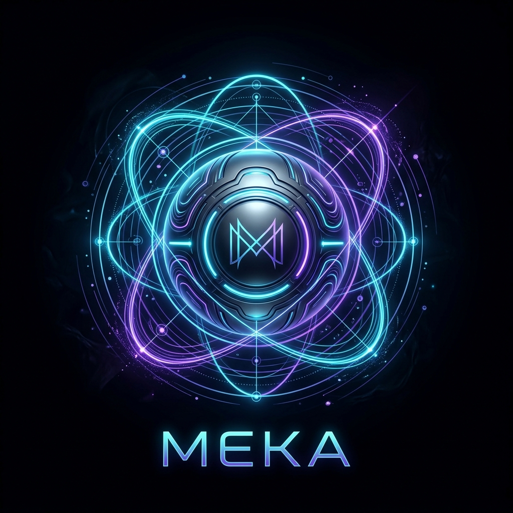
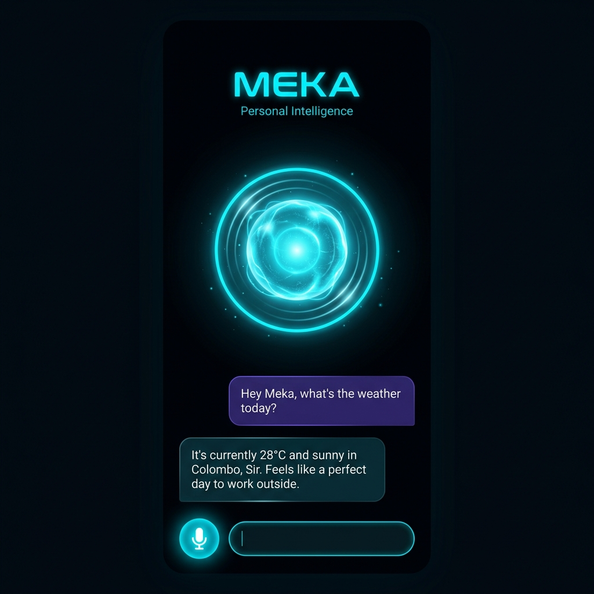
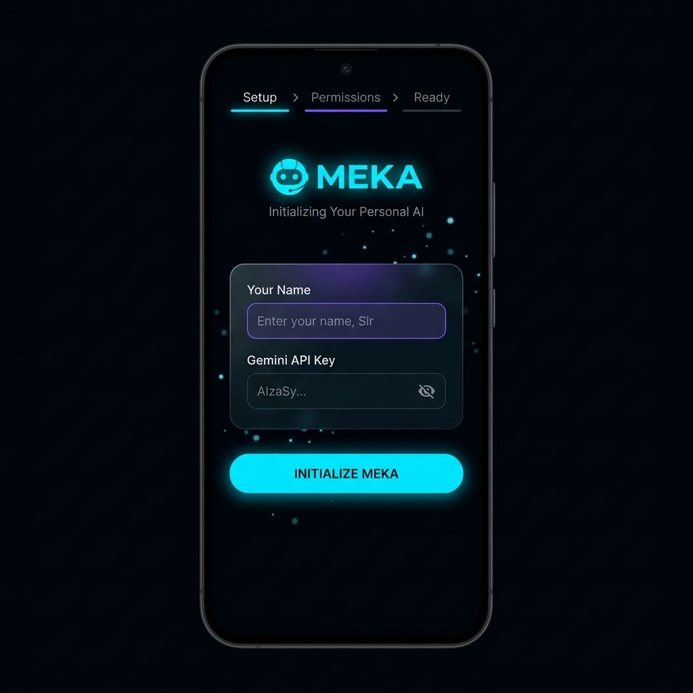
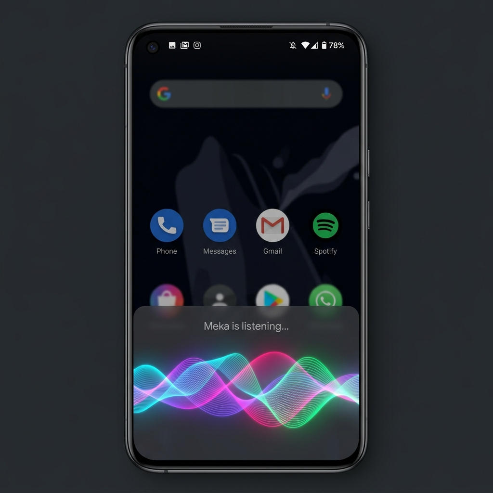

<div align="center">



# 🤖 Meka — AI Personal Assistant for Android

### *The Android Answer to Siri & JARVIS — Powered by Google Gemini*

[](https://flutter.dev)
[](https://ai.google.dev)
[](https://kotlinlang.org)
[](LICENSE)
[](https://flutter.dev/multi-platform)
[](https://github.com/BawanthaBeliwaththa/Meka/stargazers)

**Meka** is a free, open-source, JARVIS-inspired AI personal assistant for Android — the ultimate **Siri alternative for Android** users. Built with Flutter and powered by **Google Gemini**, Meka listens to your voice, controls your device, and responds with intelligence — no Apple ecosystem required.

[**⚡ Quick Start**](#-quick-start) · [**✨ Features**](#-features) · [**📱 Screenshots**](#-screenshots) · [**🛠️ Setup**](#%EF%B8%8F-setup-guide) · [**🤝 Contributing**](#-contributing)

</div>

---

## 🎯 What is Meka?

> **Looking for a Siri alternative on Android? Meet Meka.**

Meka is an open-source **AI voice assistant for Android** that goes far beyond Google Assistant. Inspired by Tony Stark's JARVIS, Meka combines real-time voice recognition, Google Gemini's large language model intelligence, and deep Android system integration to give you an assistant that **actually understands you**.

Whether you want to:
- 🗣️ **Control your phone with your voice** (calls, SMS, alarms, volume, WiFi, Bluetooth)
- 🧠 **Have intelligent conversations** with full contextual memory
- 🔊 **Use a real wake word** ("Hey Meka") just like Siri
- 🌊 **See a Siri-style animated wave UI** while it listens
- 🔁 **Run persistently in the background** — always ready, even from the lock screen

...then Meka is the Android AI assistant you've been waiting for.

---

## ✨ Features

### 🎙️ Voice Intelligence
| Feature | Description |
|---|---|
| **Wake Word Detection** | Say *"Hey Meka"* — just like Siri on iPhone |
| **Voice Input** | Speak naturally; Meka transcribes and responds |
| **Audio AI (Gemini)** | Raw WAV audio sent directly to Gemini for native understanding |
| **Text-to-Speech** | Natural voice responses read back to you |
| **Conversation Memory** | Maintains up to 20 turns of chat history |

### 📱 Deep Android Device Control
| Command | What Meka Does |
|---|---|
| *"Open YouTube"* | Launches app directly |
| *"Set alarm for 7 AM"* | Creates alarm via `AlarmClock` API |
| *"Send SMS to Mom"* | Opens SMS with pre-filled message |
| *"Call John"* | Dials via Android dialer |
| *"Set volume to 50%"* | Adjusts media volume precisely |
| *"Search for pizza near me"* | Google search in browser |
| *"Take a photo"* | Opens camera |
| *"Open WiFi settings"* | Direct settings deep-link |
| *"List my downloads"* | File system browsing |

### 🌊 Siri-Style Animated Wave Overlay
Meka renders a **system-level overlay** — a stunning animated wave UI at the bottom of your screen, visible over any app, inspired by Siri's waveform animation. Built natively in Kotlin with `WindowManager` and custom `Canvas` rendering.

### 🔒 Always-On Background Service
- Runs as a **foreground service** with a persistent notification
- **Auto-starts on device boot** via `BootReceiver`
- **Wake-lock support** to keep the microphone active
- Displays on the **lock screen** without needing to unlock

### 🌍 Cross-Platform
| Platform | Status |
|---|---|
| Android | ✅ Full support (voice, device control, overlay) |
| Windows | ✅ Desktop chat & voice |
| Linux | ✅ Desktop chat & voice |

---

## 📱 Screenshots

> *A JARVIS for your Android. Elegant, dark, and intelligent.*

<div align="center">

| 🏠 Home & Chat | 🛠️ Setup Wizard | 🌊 Wave Overlay |
|:---:|:---:|:---:|
|  |  |  |
| AI chat with voice control | Onboarding & API key setup | Siri-style system overlay |

</div>

---

## ⚡ Quick Start

### Prerequisites

- [Flutter SDK](https://docs.flutter.dev/get-started/install) `>=3.0.0`
- A [Google Gemini API key](https://aistudio.google.com/app/apikey) (free tier available)
- Android device or emulator (API 21+) **or** Windows/Linux desktop

### 1. Clone the Repository

```bash
git clone https://github.com/BawanthaBeliwaththa/Meka.git
cd Meka
```

### 2. Generate Native Platform Files

> This step creates the `android/`, `windows/`, and `linux/` directories that are not tracked in source control.

```bash
flutter create --platforms=android,windows,linux .
```

### 3. Install Dependencies

```bash
flutter pub get
```

### 4. Run the App

```bash
# Android
flutter run -d android

# Windows
flutter run -d windows

# Linux
flutter run -d linux
```

### 5. First-Time Setup

On first launch, Meka's setup wizard will guide you through:
1. **Entering your name** — Meka will address you personally
2. **Entering your Gemini API key** — powers all AI responses
3. **Granting permissions** — microphone, phone, SMS, storage

---

## 🛠️ Setup Guide

### Getting a Gemini API Key (Free)

1. Visit [Google AI Studio](https://aistudio.google.com/app/apikey)
2. Sign in with your Google account
3. Click **"Create API key"**
4. Copy the key
5. Paste it into Meka's setup screen or **Settings → API Key**

> 💡 The **Gemini Flash** model used by Meka is extremely fast and falls within Google's free tier for personal use.

### Android-Specific Permissions

Meka requires the following Android permissions for full functionality:

| Permission | Why It's Needed |
|---|---|
| `RECORD_AUDIO` | Voice input and wake word detection |
| `CALL_PHONE` | Making phone calls by voice |
| `SEND_SMS` | Sending text messages by voice |
| `READ_CONTACTS` | Calling/texting contacts by name |
| `CAMERA` | Taking photos via voice command |
| `READ/WRITE_EXTERNAL_STORAGE` | File browsing commands |
| `SYSTEM_ALERT_WINDOW` | Siri-style wave overlay over other apps |
| `FOREGROUND_SERVICE` | Always-on background service |
| `RECEIVE_BOOT_COMPLETED` | Auto-start on device boot |
| `REQUEST_IGNORE_BATTERY_OPTIMIZATIONS` | Keeps assistant alive in background |

> ⚠️ All permissions are **user-consented** and requested only when the relevant feature is first used. Meka never auto-escalates privileges.

### Android Native Source

The `android_src/` directory contains the Kotlin source files that must be placed in your generated Android module:

```
android_src/
├── MainActivity.kt            # Main Flutter activity + device control channel
├── MekaForegroundService.kt   # Always-on background service
└── BootReceiver.kt            # Auto-start on device boot
```

After running `flutter create`, copy these files to:
```
android/app/src/main/kotlin/com/example/meka/
```

---

## 🧠 How Meka Works

```
User speaks → Speech-to-Text (on-device)
                    ↓
             Text sent to Gemini Flash API
                    ↓
       Gemini returns response (text + optional JSON action)
                    ↓
     Meka parses JSON → executes Android action via MethodChannel
                    ↓
        TTS speaks the confirmation back to user
                    ↓
   (Optional) Siri-wave overlay displays during listening
```

### AI Action Commands

Meka uses a **structured JSON protocol** embedded in Gemini's responses to trigger native Android actions:

```json
{ "action": "open_app",    "app": "youtube"                       }
{ "action": "set_alarm",   "hour": 7, "minute": 0, "label": "Gym" }
{ "action": "send_sms",    "to": "Mom", "message": "On my way"    }
{ "action": "make_call",   "to": "John"                           }
{ "action": "set_volume",  "level": 70                            }
{ "action": "web_search",  "query": "weather today"               }
{ "action": "take_photo"                                           }
{ "action": "toggle_wifi"                                          }
{ "action": "toggle_bluetooth"                                     }
{ "action": "list_files",  "path": "/sdcard/Download"             }
{ "action": "read_file_content", "path": "/sdcard/note.txt"       }
{ "action": "find_files",  "query": "report"                      }
{ "action": "request_battery_optimization_ignore"                  }
```

---

## 📂 Project Structure

```
Meka/
├── android_src/                    # Kotlin native Android sources
│   ├── MainActivity.kt             # Device control via MethodChannel
│   ├── MekaForegroundService.kt    # Background foreground service
│   └── BootReceiver.kt             # Boot-start receiver
│
├── lib/
│   ├── main.dart                   # App entry point & theme
│   ├── screens/
│   │   ├── home_screen.dart        # Main chat & voice interface
│   │   ├── setup_screen.dart       # First-time onboarding wizard
│   │   └── settings_screen.dart    # Settings (API key, name, etc.)
│   └── services/
│       └── llm_service.dart        # Gemini API client & chat history
│
├── assets/
│   └── images/
│       └── logo.png                # App logo
│
├── pubspec.yaml                    # Flutter dependencies
└── flutter_launcher_icons.yaml     # App icon configuration
```

---

## 📦 Dependencies

| Package | Purpose |
|---|---|
| `google_fonts` | Premium typography (Inter, Roboto, etc.) |
| `record` | High-quality audio recording |
| `flutter_tts` | Text-to-speech voice output |
| `speech_to_text` | On-device speech recognition |
| `permission_handler` | Runtime permission management |
| `http` | Gemini API communication |
| `shared_preferences` | Local storage for settings |
| `path_provider` | File system access |
| `wakelock_plus` | Prevents CPU sleep during listening |

---

## 🆚 Meka vs. Other Android AI Assistants

| Feature | Meka 🤖 | Google Assistant | Samsung Bixby | Amazon Alexa |
|---|---|---|---|---|
| **Open Source** | ✅ Yes | ❌ No | ❌ No | ❌ No |
| **Custom AI Brain** | ✅ Gemini Flash | Google proprietary | Samsung proprietary | Amazon proprietary |
| **Siri-Style Wave UI** | ✅ Yes | ❌ No | ❌ No | ❌ No |
| **JARVIS Personality** | ✅ Yes | ❌ No | ❌ No | ❌ No |
| **Lock Screen Access** | ✅ Yes | ✅ Yes | ✅ Yes | Limited |
| **Boot Auto-Start** | ✅ Yes | ✅ System-level | ✅ System-level | ❌ No |
| **File System Access** | ✅ Yes | Limited | Limited | ❌ No |
| **Self-Hostable** | 🔶 Bring your own key | ❌ No | ❌ No | ❌ No |
| **Cross-Platform** | ✅ Android/Win/Linux | Android only | Samsung only | Limited |

---

## 🔧 Customization

### Changing the AI Personality

Edit the system prompt in `lib/services/llm_service.dart`:

```dart
String get _systemPrompt {
  return '''You are MEKA — an advanced AI personal assistant...
  // Customize Meka's personality, tone, and capabilities here
  ''';
}
```

### Adding New App Launch Targets

In `android_src/MainActivity.kt`, extend the `packages` map:

```kotlin
val packages = mapOf(
    "youtube" to "com.google.android.youtube",
    "your_app" to "com.your.package.name",  // ← Add here
    // ...
)
```

### Changing the App Icon

1. Replace `assets/images/logo.png` with your icon (1024×1024 PNG recommended)
2. Run:
   ```bash
   dart run flutter_launcher_icons
   ```

---

## 🤝 Contributing

Contributions are welcome! Here's how to get started:

1. **Fork** the repository
2. **Create** a feature branch: `git checkout -b feature/amazing-feature`
3. **Commit** your changes: `git commit -m 'Add amazing feature'`
4. **Push** to the branch: `git push origin feature/amazing-feature`
5. **Open** a Pull Request

### Ideas for Contribution
- 🌐 Multi-language support
- 🔊 Custom wake word engine integration
- 🏠 Smart home (Google Home / Alexa) integration
- 📅 Google Calendar integration
- 🎵 Spotify / YouTube Music voice control
- 🔑 Biometric authentication
- 🌙 Sleep mode / Do Not Disturb integration

---

## ❓ FAQ

**Q: Is this a real Siri alternative for Android?**  
A: Yes! Meka provides voice-activated AI assistance, device control, and a Siri-style animated wave UI — all on Android. It uses Google Gemini instead of Apple's proprietary AI.

**Q: Does Meka work offline?**  
A: Speech recognition (STT) runs on-device. However, AI responses require an internet connection to reach the Gemini API.

**Q: Is my data private?**  
A: Your API key is stored locally on your device using `SharedPreferences`. Voice audio is processed locally by Android's STT. Text queries are sent to Google's Gemini API, subject to [Google's privacy policy](https://policies.google.com/privacy).

**Q: Is the Gemini API free?**  
A: Yes, Google provides a generous free tier for Gemini Flash. Visit [Google AI Studio](https://aistudio.google.com/app/apikey) for current limits.

**Q: Can I use this on iOS?**  
A: The Flutter UI works cross-platform, but the deep Android device control features (calls, SMS, overlay) are Android-only. iOS support would require a separate implementation.

**Q: How is this different from just using ChatGPT?**  
A: Meka is deeply integrated with Android system APIs. It doesn't just chat — it *acts*. It can make calls, set alarms, control volume, open apps, and display a system-wide overlay, all via voice.

---

## 🔐 Security

- Meka stores your API key only in **local device storage** (`SharedPreferences`)
- No data is sent to any third-party servers except the Google Gemini API
- All device permissions are **explicitly requested** from the user
- The assistant never auto-escalates privileges
- Review the full permission list in `android_src/MainActivity.kt`

---

## 📜 License

This project is licensed under the **MIT License** — see the [LICENSE](LICENSE) file for details.

You are free to use, modify, and distribute Meka. Attribution appreciated but not required.

---

## 🌟 Acknowledgements

- 🤖 **Google Gemini** — The AI brain powering Meka's intelligence
- 🎨 **Flutter Team** — The cross-platform framework
- 🎬 **Marvel / Iron Man** — Inspiration for the JARVIS-like personality
- 🎵 **SiriWave** — Inspiration for the wave animation aesthetic

---

<div align="center">

**If Meka saved you time or impressed you, please give it a ⭐ on GitHub!**

Made with ❤️ by [Bawantha Beliwaththa](https://github.com/BawanthaBeliwaththa)

*Meka — Always listening. Always ready.*

</div>

---

<!-- SEO Keywords: android siri alternative, siri for android, ai personal assistant android open source, jarvis android app, google gemini voice assistant android, flutter voice assistant, android ai assistant app, hey siri android equivalent, android voice control app, ai assistant like siri for android, free siri alternative android, intelligent voice assistant android, gemini ai android app, android assistant wake word, siri wave android -->
